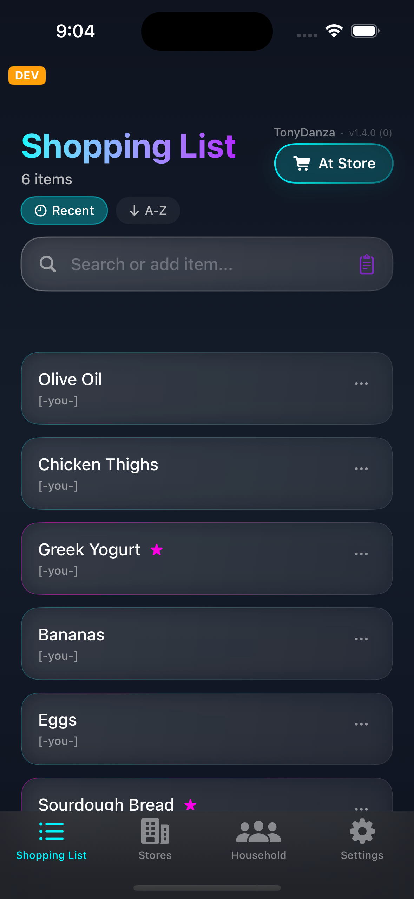
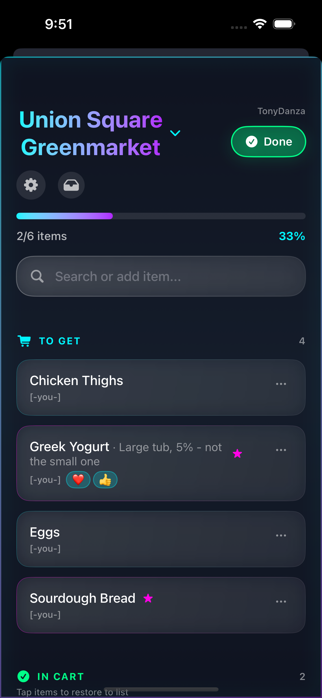
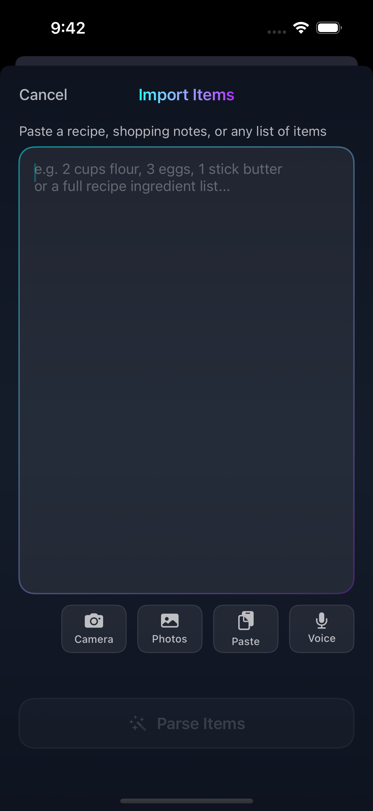
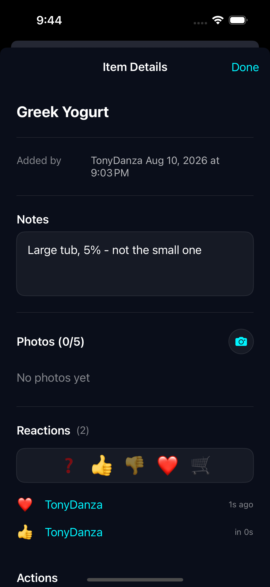
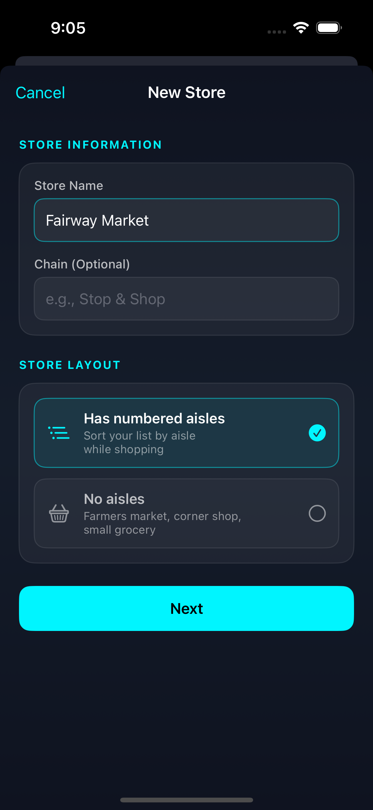
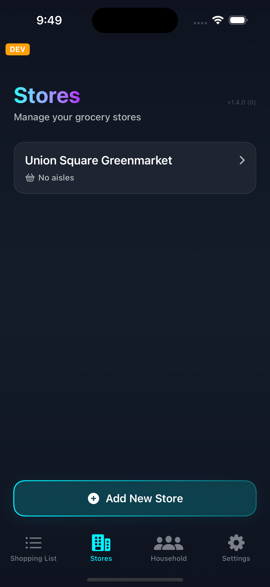

# Got Dill?

A shared grocery list for a household, built around the way people actually shop: everyone adds to one live list, one person takes it to the store, and the app reorders that list to match the store's aisles so the shopper walks the floor once instead of three times.

iOS 17+, SwiftUI, AWS Amplify Gen 2.

| The shared list | At the store |
|---|---|
|  |  |
| **Import anything** | **Item detail** |
|  |  |
| **Store setup** | **Your stores** |
|  |  |

## What it does

**One list, everyone edits.** Items sync live across every household member via AppSync subscriptions. Each item shows who added it. Add by typing, by picking from a shared product catalog, by dictating out loud, or by pasting/photographing a recipe and letting Claude parse it into individual items.

**Aisle-ordered shopping.** Photograph a store's aisle directory and a Claude-backed pipeline OCRs it, matches the product catalog against the extracted aisles, and infers placements for anything it didn't find. At the store, the list regroups by aisle in walking order.

**A real shopping session.** One member goes "At Store" and the rest of the household sees a live read-only view of what's already in the cart. Items added from home appear on the shopper's screen mid-trip. Sessions that get abandoned can be force-finished by anyone after an hour.

**Items carry context.** Notes, quantities, photos, emoji reactions, and a per-item lock so nobody deletes the thing you're arguing about.

## Architecture

```
GroceryApp/
  Models/       Plain structs, hand-decoded from JSONValue — no codegen
  Services/     Singletons: Amplify, Subscriptions, Stores, ProductCache,
                UserCache, AisleExtraction, SpeechDictation, ShopperReminder
  ViewModels/   ShoppingListViewModel — the app's center of gravity
  Views/        SwiftUI, feature per file; Components/ for reusables
amplify/
  auth/         Cognito — email + password
  data/         GraphQL schema and Lambda resolvers
  storage/      S3 for item photos and aisle-scan uploads
```

MVVM with one substantial `@MainActor` view model injected via `.environmentObject`. Mutations are optimistic: local state changes first, the network call follows, and subscription echoes for in-flight IDs are ignored.

There is **no generated GraphQL client**. Every call is a hand-written document string with manual `JSONValue` decoding, and every request must specify Cognito user-pool auth explicitly:

```swift
let request = GraphQLRequest<JSONValue>(
    document: document,
    variables: ["input": input],
    responseType: JSONValue.self,
    authMode: AWSAuthorizationType.amazonCognitoUserPools  // required
)
```

Omitting `authMode` makes Amplify fall back to API-key auth and fail authorization silently. This has caused production incidents twice.

Adding a field to the schema means touching **four** places: `amplify/data/resource.ts`, the mutation document, the query document, and the relevant subscription's selection set. Skipping the subscription is the classic bug — the writer sees the new value and nobody else does.

### Data model

Items move through three states:

| Status | Meaning |
|---|---|
| `ACTIVE` | On the list, to buy |
| `IN_CART` | Picked up during the current trip |
| `SUGGESTION` | Bought before, available to re-add |

Shopping phase lives on the household, not the item: `shoppingStatus` is `IDLE` or `AT_STORE`, alongside `activeShopperId`, `shoppingStoreId`, and `shoppingStartedAt`.

| Transition | Status change |
|---|---|
| Add an item | → `ACTIVE` |
| Cross off while shopping | `ACTIVE` → `IN_CART` |
| Finish the trip | `IN_CART` and `ACTIVE` → `SUGGESTION` |

### AI features

| Feature | Model | Where |
|---|---|---|
| Aisle directory OCR and mapping | Claude Haiku 4.5 | `aisleExtractionJobHandler` |
| Single/batch aisle inference | Claude Sonnet 4.6 | `inferProductAisleFunction` |
| Recipe and list parsing | Claude | `parseIngredientsFunction` |
| Voice dictation | OpenAI Whisper | `transcribeAudioFunction` |

Keys resolve from SSM at runtime via Amplify secrets — `ANTHROPIC_API_KEY` and `OPENAI_API_KEY`. Set them per environment in the Amplify Console under App settings → Secrets.

## Getting started

You need Xcode 16+, Node 18+, and an AWS account with the CLI configured.

```bash
git clone git@github.com:DrBenedictPorkins/NotOurGroceries.git
cd NotOurGroceries
npm install

# Start a personal sandbox backend — this writes amplify_outputs.json
npx ampx sandbox

# Or pull the deployed production config
AWS_PROFILE=mine npx ampx generate outputs --app-id d2rsreno8nimo5 --branch main
```

Then open `GroceryApp.xcodeproj` and run. Config files (`amplify_outputs*.json`) are gitignored — you must generate your own.

Seed the shared product catalog if your backend is empty:

```bash
AWS_PROFILE=mine uv run python scripts/seed_products.py
```

### Environments

| | Config file | Cognito pool | AppSync API |
|---|---|---|---|
| Development | `amplify_outputs_dev.json` | `us-east-1_PWCfwCEUh` | `awxymvwkinht3dofuywc73phwy` |
| Production | `amplify_outputs_prod.json` | `us-east-1_OIBNTn0XB` | `sve64qw4c5cu5jerw6gn2jrvd4` |

The two environments have **separate user pools and separate databases** — an account created in one does not exist in the other.

`AmplifyService.configure()` selects between them with `#if DEBUG`, so debug and simulator builds hit the sandbox and only Release builds touch production. The orange "DEV" badge in the corner reflects the same build configuration.

## Building

Raw `xcodebuild` has an unreliable simulator-destination lookup on some machines. Building from Xcode (`⌘B`) is the dependable path.

The test suite currently **does not compile** — roughly 61 errors from tests written against a pre-rename API (`ItemStatus.crossedOff`, `viewModel.activeItems`) that hasn't existed for some time. CI does not run tests, which is how the drift went unnoticed. Repairing the suite and adding a CI test step are both open.

## Releasing

`main` always tracks the *next* version under development; tags mark actual releases. The release script owns the marketing version and CI stamps a datetime build number — **never edit `MARKETING_VERSION` or `CURRENT_PROJECT_VERSION` by hand.**

```bash
# 1. Put changes under [Unreleased] in CHANGELOG.md, then:
./scripts/release.sh              # tag current version, bump main to next minor
./scripts/release.sh --next patch # or major, or none for a hotfix
./scripts/release.sh --dry-run    # preview

# 2. Push — this triggers everything
git push origin main --tags
```

Pushing a `v*` tag runs `.github/workflows/testflight.yml`, which archives, signs, and uploads to TestFlight (~9 minutes). Pushing to `main` separately triggers the Amplify Console to deploy the backend. Builds reach the Family internal testing group automatically once Apple finishes processing.

Because backend and app deploy from the same push, a schema change lands before the app build that depends on it. Additive nullable fields are safe; anything else needs staging across two releases.

## Screenshots

Captured from the simulator at 1179×2556 against the **sandbox** backend. Every image in `docs/screenshots/` is referenced above; the set is deliberately kept small rather than exhaustive.

Two screens are still missing, both blocked on the same thing — a store with a scanned aisle directory:

- **Aisle-ordered shopping**, the feature that most distinguishes this app. The version shown above is a store with *no* aisles, so the list is flat.
- **The aisle scanner** — photographing a directory sign and watching the extraction run.

Producing either needs a photo of a real aisle sign plus a working `ANTHROPIC_API_KEY` in the sandbox environment.

To add a screen, run against sandbox (debug builds do this automatically) so no household's real data lands in a committed image:

```bash
xcrun simctl io booted screenshot docs/screenshots/10-aisle-scan.png
```

## Operations

Common admin recipes — clearing tables for a fresh start, clearing only shopping data while preserving accounts, and point-in-time restore — are documented in [`CLAUDE.md`](CLAUDE.md). All AWS CLI calls need `AWS_PROFILE=mine`.

Point-in-time recovery is enabled on every production table holding user data. DynamoDB always restores to a *new* table, so recovery means restore-to-temp, verify, copy back, drop temp — no redeploy required.
